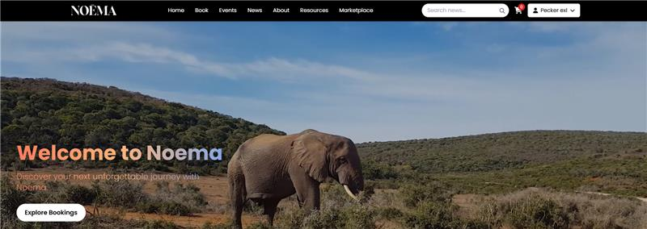
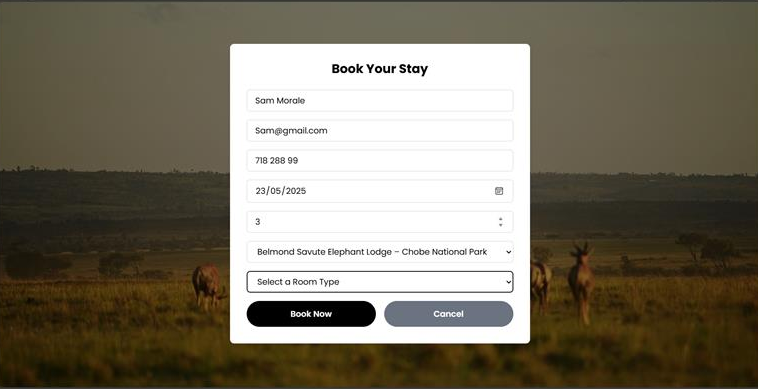
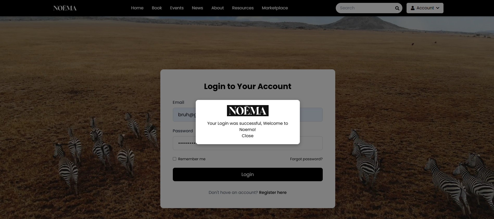
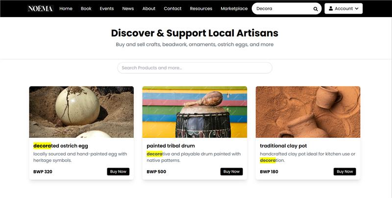

# 🌍 Noema

Noema is a modern, interactive tourism platform designed to showcase travel destinations, provide up-to-date travel news, and offer booking and marketplace functionalities. 
Built for both desktop and mobile users, Noema combines elegant design with intuitive user experience, making it easy for travelers to explore destinations and plan their trips.

---

## 📸 Screenshots

  
*Explore destinations and navigate the website.*

  
*See upcoming events and activities.*

  
*Secure login and registration for users.*

  
*Browse and purchase products.*

---

## 🚀 Features

### 🌐 General
- 🏠 **Home Page** – Main landing page with overview of the platform.  
- ℹ️ **About Us** – Information about the platform and the team.  
- 📚 **Resources** – Guides, tips, or links for travelers.  
- 📰 **Current Affairs** – Blog/news section for travel updates.

### 👤 User Account
- 🔑 **Login & Register** – Secure authentication for users.  
- ⚙️ **Account Settings** – Update personal information, password, and preferences.

### 🎫 Booking
- 🗓️ **Book** – Book trips or events.  
- 🎉 **Events** – View upcoming travel events and activities.

### 🛍️ E-commerce / Marketplace
- 🛒 **Marketplace** – Browse products related to travel or souvenirs.  
- 🛍️ **Cart** – Add products to the cart.  
- 💳 **Checkout** – Complete purchases  ,confirm orders and send receipts to provided email address.

### 💻 Backend / Server
- 🖥️ **Server** – Node.js backend handling user accounts, bookings, and marketplace transactions.  
- 🗄️ **DatabaseTables.sql** – Structure of the database tables.

### 🖼️ Assets
- 📷 **Photos** – All image assets for the website.  
- 🏷️ **Logo1.png, Logo2.png** – Brand logos for the site.

---

## 🛠️ Technologies Used

| Frontend | Backend | Database | Version Control | Assets |
|----------|--------|----------|----------------|-------|
| React ⚛️ | Node.js 🟩 | SQL 🟦 | Git 🐙 | Photos & Logos 📷 |
| HTML 🟧 | Express ⚡ | MongoDB 🟢 | GitHub 🐱 | Logos 🏷️ |
| CSS 🟦 | | | | Tailwind.css 🎨 |
| JavaScript 🟨 | | | | |

---

## 📥 Installation

To run this project locally:

1. Clone the repository:

    ```bash
    git clone https://github.com/zingerw1/Tourism-Project.git
    
2. Navigate to the project directory:

     ```bash
    cd Tourism-Project/Tourism\ Website
    
3. Install dependencies:
     ```bash
    npm install


5. Start the server:
     ```bash
    npm start
     
Open your browser and navigate to:
   ```bash
  http://localhost:3000


